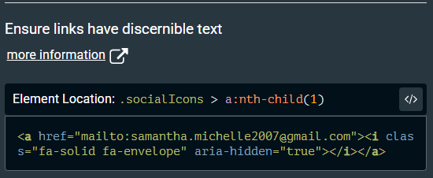
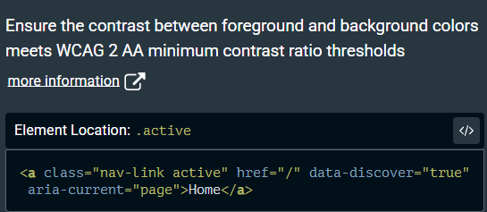
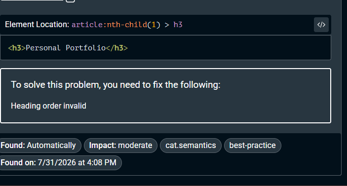

## Accessibility Audit Using axe DevTools

Based on the axe DevTools accessibility audit, three types of accessibility issues were found.

### 1. Links Do Not Have Discernible Text

The email link only contained an icon without accessible text. The same issue was also found on the Instagram and LinkedIn links.

**Fix:** Descriptive `aria-label` attributes were added to the email, Instagram, and LinkedIn links so that screen-reader users can understand the purpose of each link.

---

### 2. Elements Do Not Meet the Minimum Color Contrast Ratio

Some text elements did not have sufficient contrast against their background. The same issue was found in three other locations.

**Fix:** The affected text colors were adjusted to provide better contrast against the background and improve readability.

---

### 3. Heading Order Is Not Semantically Correct

The heading levels did not follow a logical semantic order.

**Fix:** The heading hierarchy was corrected so that the page follows a consistent structure, such as `<h1>` followed by `<h2>` and other appropriate subheadings.

---

### Issues Fixed

After applying the fixes, the page was scanned again using axe DevTools to confirm that the identified accessibility issues had been resolved.